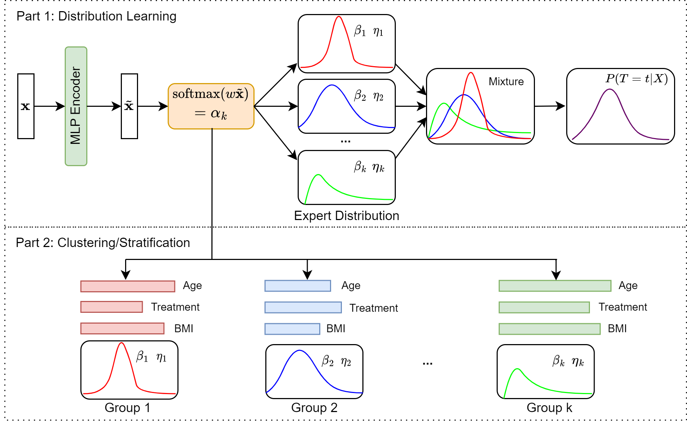

# Deep Clustering Survival Machines with Interpretable Expert Distributions

This repository holds the official code for the paper 
"[*Deep Clustering Survival Machines with Interpretable Expert Distributions*](https://arxiv.org/abs/2301.11826)", 
 published in [ISBI 2023](http://2023.biomedicalimaging.org/en/).  


### 🦸‍♀ Motivation
Conventional survival analysis methods are typically ineffective 
to characterize heterogeneity (subgrouping characteristic) in the 
population while such information can be used to assist predictive modeling.
In this study, we propose a hybrid survival analysis method, referred
to as **deep clustering survival machines (DCSM)**, that combines the 
discriminative and generative mechanisms to leverage the heterogeneity 
to assist time-to-event prediction as well as clustering.

### 💡 Method



Similar to the mixture models, we assume that the timing information of 
survival data is _generatively_ described by a mixture of certain 
numbers of parametric distributions, i.e., _expert distributions_. 
We learn weights of the expert distributions for individual instances 
according to their features _discriminatively_ such that each 
instance's survival information can be characterized by a weighted 
combination of the learned constant expert distributions. 
This method also facilitates interpretable subgrouping/clustering 
of all instances according to their associated expert distributions.

### 📝 Requirements

All required libraries are included in the conda environment specified by 
[`requirements.txt`](requirements.txt). To install and activate it, follow the instructions below:

```
conda create -n DCSM               # create an environment named "DCSM"
conda activate DCSM                # activate environment
pip install -r requirements.txt       # install required packages
```

### 🔨 Usage

File [`main.py`](main.py) trains and evaluates the DCSM model. 
It accepts following arguments:

```
  --dataset DATASET     dataset in [sim, support, flchain, PBC, FRAMINGHAM]
  --is_normalize IS_NORMALIZE
                        whether to normalize data
  --is_cluster IS_CLUSTER
                        whether to use DCSM to do clustering
  --is_generate_sim IS_GENERATE_SIM
                        whether we generate simulation data
  --is_save_sim IS_SAVE_SIM
                        whether we save simulation data
  --num_inst NUM_INST   specifies the number of instances for simulation data
  --num_feat NUM_FEAT   specifies the number of features for simulation data
  --cuda_device CUDA_DEVICE
                        specifies the index of the cuda device
  --discount DISCOUNT   specifies number of discount parameter
  --weibull_shape WEIBULL_SHAPE
                        specifies the Weibull shape
  --num_cluster NUM_CLUSTER
                        specifies the number of clusters
  --train_DCSM TRAIN_DCSM
                        whether to train DCSM
```

* The DCSM model is implemented in [`models/dcsm_torch.py`](models/dcsm_torch.py) which
includes definitons for the Deep Clustering Survival Machines module.
The main interface is the DeepClusteringSurvivalMachines class which inherits
from torch.nn.Module. 
* [`models/dcsm_api.py`](models/dcsm_api.py) is a wrapper 
around torch implementations and provides a convenient API to train 
Deep Clustering Survival Machines.
* [`utils/model_utils.py`](utils/model_utils.py) provides several functions 
for model training utilities.
* Data are provided in the [`datasets`](datasets) folder, 
which includes four real-world datasets including support, 
flchain, PBC and FRAMINGHAM that are presented in our paper. 
* [`utils/data_utils.py`](utils/data_utils.py) provides the data loader 
to load these datasets mentioned above. 
We also provide the functions to generate synthetic data in this file. 
* In [`utils/losses.py`](utils/losses.py), we define 
various losses for the censored and uncensored
instances of data corresponding to Weibull distribution. 
* [`utils/plottings.py`](utils/plottings.py) provides several functions to 
plot figures such as the Kaplan-Meier curves.
* [`utils/general_utils.py`](utils/general-utils.py) provides several helper functions 
for model training and testing.

### 🤝 Acknowledgements

- The real-world datasets and their utility functions for data preprocessing 
were taken from Nagpal *et al.*'s and 
[auton-survival repository](https://github.com/autonlab/auton-survival) and 
Manduchi *et al.*'s [vadesc repository](https://github.com/i6092467/vadesc).
- The generation process of synthetic data follows Manduchi *et al.*'s 
[vadesc repository](https://github.com/i6092467/vadesc).

### 📭 Maintainers

[Bojian Hou](http://bojianhou.com) 
- ([bojian.hou@pennmedicine.upenn.edu](mailto:bojian.hou@pennmedicine.upenn.edu))
- ([hobo.hbj@gmail.com](mailto:hobo.hbj@gmail.com))


### 📚 References

Below are some important references that inspires our work:
- Chirag Nagpal, Xinyu Li, and Artur Dubrawski, “Deep
survival machines: Fully parametric survival regression
and representation learning for censored data with competing risks,” 
**IEEE Journal of Biomedical and Health
Informatics**, vol. 25, no. 8, pp. 3163–3175, 2021.
- Laura Manduchi, Riˇcards Marcinkeviˇcs, Michela C
Massi, Thomas Weikert, Alexander Sauter, Verena
Gotta, Timothy M ̈uller, Flavio Vasella, Marian C Neidert, 
Marc Pfister, et al., “A deep variational approach to clustering survival data,” in
**Proceedings of the Tenth International Conference on Learning Representations**, 2022.
- Paidamoyo Chapfuwa, Chunyuan Li, Nikhil Mehta,
Lawrence Carin, and Ricardo Henao, “Survival cluster analysis,” 
in **Proceedings of the ACM Conference on Health, Inference, and Learning**, 
2020, pp. 60–68.


### 🙂 Citation

```
@inproceedings{HouFan2023,
  title={Deep Clustering Survival Machines with Interpretable Expert Distribution},
  author={Bojian Hou, Hongming Li, Zhicheng Jiao, Zhen Zhou, Hao Zheng, Yong Fan},
  booktitle={International Symposium on Biomedical Imaging},
  year={2023},
}
```
